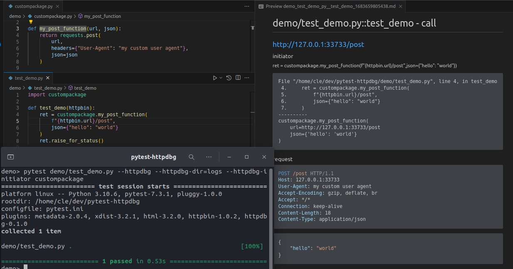

# pytest-httpdbg

A pytest plugin to record HTTP(S) requests with stack trace.



## installation 

```
pip install pytest-httpdbg
```

## usage

### pytest custom options

```
  --httpdbg             record HTTP(S) requests
  --httpdbg-dir=HTTPDBG_DIR
                        save httpdbg traces in a directory
  --httpdbg-no-clean    do not clean the httpdbg directory
  --httpdbg-initiator=HTTPDBG_INITIATOR
                        add a new initiator (package) for httpdbg
```
### option httpdbg

Enables the record of the HTTP requests.

### option httpdbg-dir

Indicates where to save the log files.

### option httpdbg-no-clean

Does not clean existing log files if the log directory is not empty.

### option http-initiator

An initiator is the function/method that is at the origin of the HTTP requests. By default, we already support some packages but you can add your own initiators. 

To add a new package in the list of initiators, you can use the `http-initiator` command line argument.

You can use any package as an initiator, this is not limited to HTTP requests.

## test report

When the test is finished (teardown step included), one log file in markdown format is written. The path to this log file is stashed in the item when the test starts (before the setup step), even if the file not exists yet.

### pytest-html

You can copy the following code in your top-level `conftest.py` to include the logs into your pytest-html report.

```python
import os

import pytest

from pytest_httpdbg import httpdbg_record_filename


@pytest.hookimpl(hookwrapper=True)
def pytest_runtest_makereport(item, call):
    pytest_html = item.config.pluginmanager.getplugin("html")
    outcome = yield
    report = outcome.get_result()
    extras = getattr(report, "extras", [])

    if call.when == "call":
        if httpdbg_record_filename in item.stash:
            extras.append(
                pytest_html.extras.url(
                    os.path.basename(item.stash[httpdbg_record_filename]),
                    name="HTTPDBG",
                )
            )
            report.extras = extras
```

This example works if you use the same directory for the html test report file and the httpdbg logs. 
 
 `pytest demo/ --httpdbg --httpdbg-dir report  --html=report/report.html`

If this is not the case, you must adapt it to your configuration.

## documentation

https://httpdbg.readthedocs.io/en/latest/pytest/
